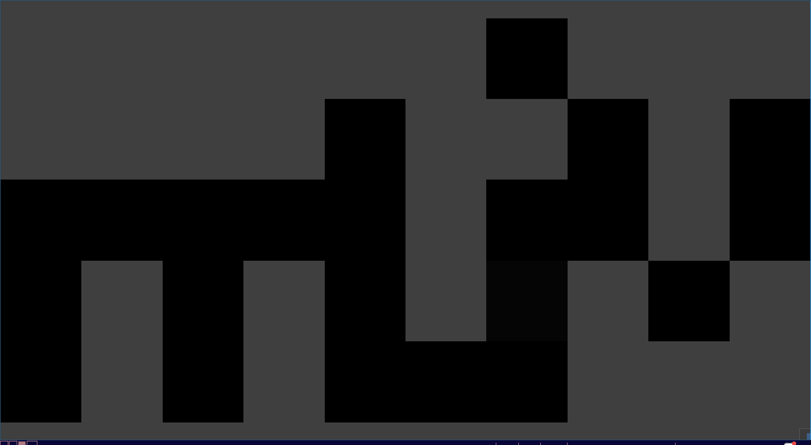

# R-liv
Rust Lean Image Viewer - Fast and configurable image viewer inspired by JPEGView by David Kleiner

R-liv is meant to be a small, lean, fast and configurable image viewer inspired by [JPEGView by David Kleiner](https://sourceforge.net/projects/jpegview/).
It's philosophy is similar - minimal GUI with maximal image and utility.

## Features

- Support for multiple formats [^1]
- Support for transparency

## Planned features:

- Basic image processing with live preview
- Saving
- Exif reading and error checking

## But why?

Honestly, because JPEGView does not have Linux support.
And I want to learn Rust.

## And for who?

For powerusers, who want a image viewer that lets them do things quickly and not impact performance.

For normal users, who want a fast image viewer.

For editors, taht don't want to open a fully featured editor to do something basic.

[^1]: https://github.com/image-rs/image/blob/master/README.md#supported-image-formats
