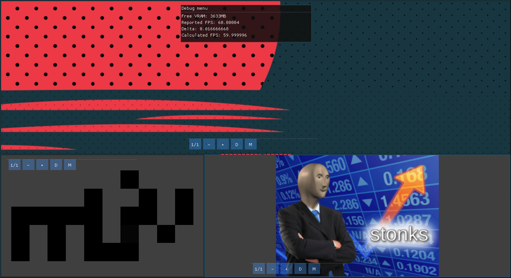

# R-liv
Rust Lean Image Viewer - Fast and configurable image viewer inspired by JPEGView by David Kleiner

# THIS IS ARCHIVED
I've started making a new and better version, with Vulkan and tokio. This project is for me to learn, remember?

R-liv is meant to be a small, lean, fast and configurable image viewer inspired by [JPEGView by David Kleiner](https://sourceforge.net/projects/jpegview/).
It's philosophy is similar - minimal GUI with maximal image and utility.



## Features

- Support for multiple formats [^1]
- Support for transparency
- Pixel art friendly

## Planned features:

- Basic image processing with live preview
- Saving
- Exif reading and error checking

## Download

[Stable releases](https://github.com/3top1a/r-liv/releases)

[Unstable builds](https://github.com/3top1a/r-liv/actions)

## Compiling from source

```
git clone https://github.com/3top1a/r-liv
cd r-liv
cargo build --release
```

the binary will be under `target/release/`

## Usage

**R-liv only supports opening an image, otherwise it will error**

`r-liv image.png`

On windows you can drag an image on the .exe to open it with R-liv.

## But why?

Honestly, because JPEGView does not have Linux support.
And I want to learn Rust.

## And for who?

For powerusers, who want a image viewer that lets them do things quickly and not impact performance.

For normal users, who want a fast image viewer.

For editors, that don't want to open a fully featured editor to do something basic like flipping or rotating an image.

[^1]: https://github.com/image-rs/image/blob/master/README.md#supported-image-formats
